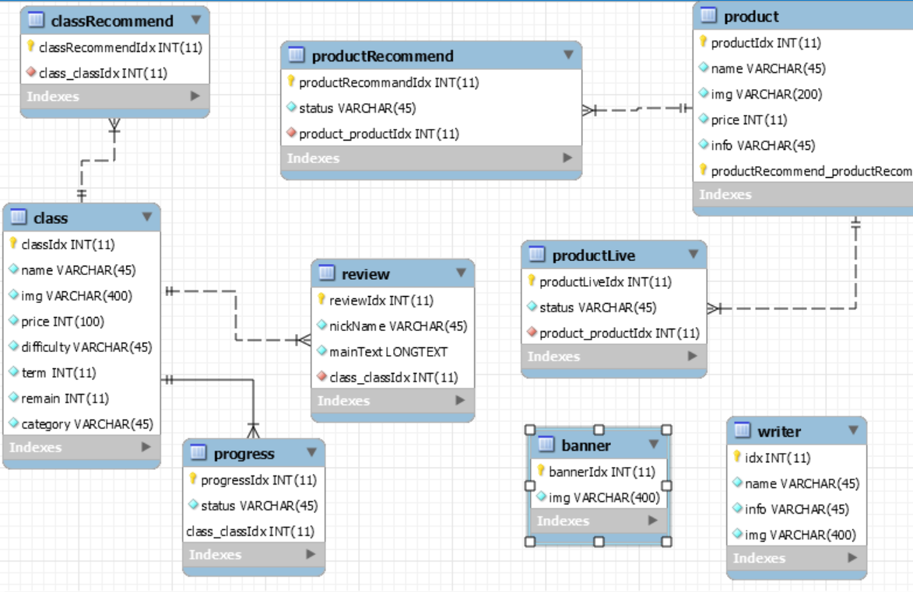
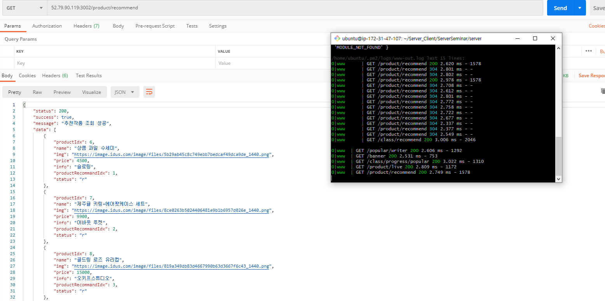

# 서버 - 클라이언트 합동세미나

### Server : 이지윤, 최정균

# 1️⃣ Level1 : API 명세서

✔ [API Wiki 만들기](https://github.com/26thiOS-Design-hapdongSeminar/Server_Client/wiki/%F0%9F%96%8DAPI-Explain%F0%9F%96%8D) 

  

# 2️⃣ Level2 : ERD 

  

# 3️⃣ Level3 : EC2 - RDS

